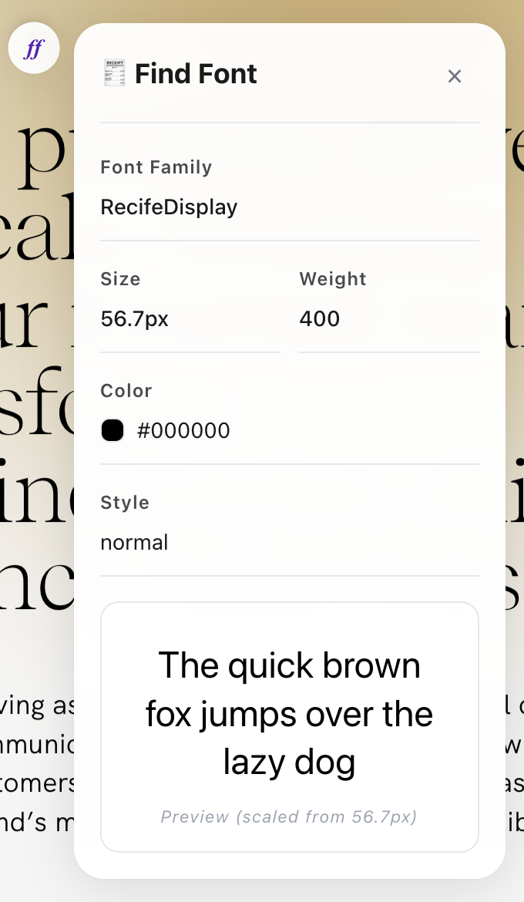
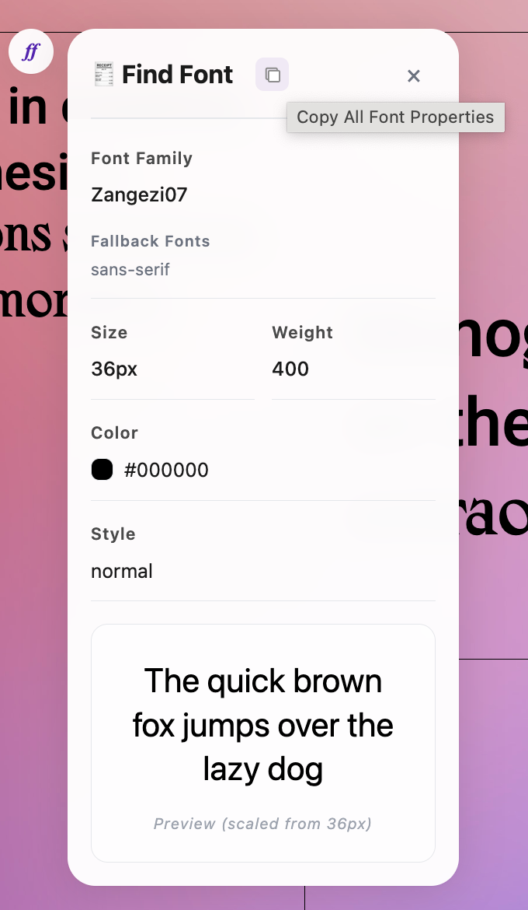

# FindFont - Font Identifier

A Chrome extension that helps designers and developers quickly identify fonts used on any webpage. Simply select text to see detailed font information in an elegant floating panel.



## ✨ Features

- **Show you the basic font info when you select text**
- **Reveal all the fallback fonts**
- **Let you preview how the font actually looks**
- **Plus, you can copy any property with one click, just for developers' and designers' convenience**

## 🚀 Installation

### From Chrome Web Store

1. Visit [FindFont on Chrome Web Store](link-coming-soon)
2. Click "Add to Chrome"
3. Start identifying fonts!

### Manual Installation (Development)

1. Clone this repository:

   ```bash
   git clone https://github.com/yourusername/findfont.git
   cd findfont
   ```

2. Install dependencies and build:

   ```bash
   npm install
   npm run build
   ```

3. Load in Chrome:
   - Open `chrome://extensions/`
   - Enable "Developer mode"
   - Click "Load unpacked" and select the `dist` folder

## 📖 How to Use

1. **Select Text**: Highlight any text on a webpage
2. **Click the Floating Button**: A small button will appear near your selection
3. **View Font Details**: Click the button to open the font information panel
4. **Copy Properties**: Click any property to copy it to clipboard



## 🛠️ Development

Built with **TypeScript**, **HTML/CSS**, and **Chrome Extension Manifest V3**.

### Commands

```bash
npm install    # Install dependencies
npm run build  # Build for production
```
